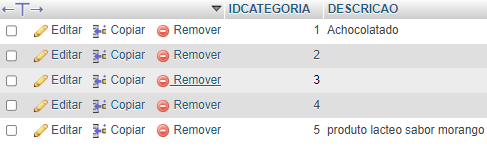
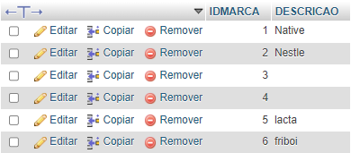

# CadEcommerce
Projeto criado em sala de aula com ajuda do Professor Leonardo Santiago Sidon da Rocha.

## 📄Descrição

Esta atividade teve como função a utilização de funcionalidade "novas".

Este trabalho teve como base a programação com banco de dados e a linguagem de php, onde aprendemos sobre insert select.

## 🥸 O que é e para que serve o insert into

O INSERT INTO é uma instrução que adiciona dados em banco de dados específicos da tabela. Neste exemplo, estamos adicionando dados à tabela Students. Seguindo adiante, entre os colchetes, temos as colunas de tabela para as quais queremos adicionar valores (name, lastname, email).

info base: [hostinger](https://www.hostinger.com.br)

## 🥸 O que é e para que serve o select into

O SELECT é o comando mais usado do MySQL. Por ele, fazemos consultas e trazemos para o PHP os dados existentes em uma tabela do banco de dados. Estes dados são colocados em um array (ou seja, uma variável que é uma matriz de dados)

info base: [Homehost](https://www.homehost.com.br/)

## 😁Exemplos de produtos adicionados

Este é um exemplo de um produto que foi adicionado neste banco de dados ("produto lacteo sabor morango")

## 😁Exemplos de marcas adicionadas

Este é um exemplo de 2 marcas que foram adicionadas neste banco de dados ("lacta" e "friboi")

### 🤖Tecologias utilizadas
* HTML 5
* CSS 3
* PHP
* MysqlAdmin  
## 🔧Ferramentas utilizadas
* Visual Code
* GitHub
## 🔗Fontes consultadas
* Chat gpt
* Google
## 🤜🤛Colaboradores
 [Leonardo Rocha](https://github.com/leonardorochamarista)
## ✒️Autores
[Link do meu perfil :p](https://github.com/juanbyluna)
